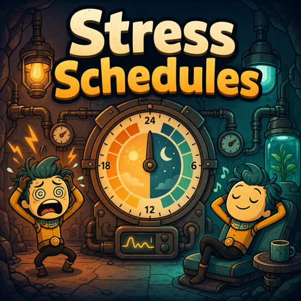

# Stress Schedules



[Install from Steam Workshop](https://steamcommunity.com/sharedfiles/filedetails/?id=3770102539)

Mod locale per Oxygen Not Included che crea due orari automatici:

- `Mild-Stressed`: la prima metà dei blocchi di lavoro resta lavoro e la seconda
  metà diventa pausa, in due gruppi per evitare spostamenti ogni ora.
- `Stressed`: tutti i blocchi di lavoro dell'orario predefinito diventano pausa.

Ogni duplicante viene spostato automaticamente in base al proprio stress e
torna all'orario che aveva prima dell'intervento della mod quando si riprende.
Le soglie separate di ingresso e uscita evitano continui cambi di orario vicino
al limite.

## Soglie predefinite

| Transizione | Stress |
| --- | ---: |
| Normale → Mild-Stressed | 35% |
| Mild-Stressed → Stressed | 60% |
| Stressed → Mild-Stressed | sotto 45% |
| Mild-Stressed → normale | sotto 20% |

Le soglie si modificano direttamente da `Mods` → `Stress Schedules` →
`Opzioni`. La nuova configurazione viene applicata subito e viene conservata
anche passando dall'installazione locale a quella Workshop. Sia i duplicanti
organici sia quelli bionici vengono gestiti dagli stessi due orari di recupero.

## Build

La build usa direttamente gli assembly dell'installazione Steam locale:

```sh
dotnet build -c Release
dotnet test -c Release
./install-local.sh
```

Per un'installazione di ONI non standard si può passare a MSBuild la proprietà
`OniManagedDir`.
