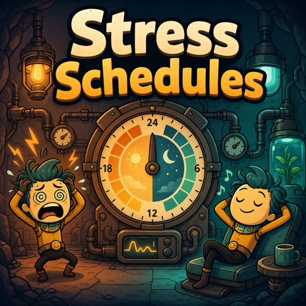

# Stress Schedules



[Install from Steam Workshop](https://steamcommunity.com/sharedfiles/filedetails/?id=3770102539)

Mod locale per Oxygen Not Included che crea due orari automatici:

- `Mild-Stressed`: la prima metà dei blocchi di lavoro resta lavoro e la seconda
  metà diventa pausa, in due gruppi per evitare spostamenti ogni ora.
- `Stressed`: tutti i blocchi di lavoro dell'orario predefinito diventano pausa.

Ogni duplicante viene spostato automaticamente in base al proprio stress. La
salute ha precedenza: al 40% o meno viene forzato su `Stressed` finché non
recupera almeno il 60%. Al termine del recupero torna la normale logica dello
stress e, quando si riprende del tutto, viene ripristinato l'orario originale.
Le soglie separate di ingresso e uscita evitano continui cambi vicino ai
limiti. Per evitare che una crisi fermi completamente la colonia, almeno un
duplicante resta sul proprio orario di lavoro anche quando tutti avrebbero
bisogno di recuperare.

## Soglie predefinite

| Transizione | Stress |
| --- | ---: |
| Normale → Mild-Stressed | 35% |
| Mild-Stressed → Stressed | 60% |
| Stressed → Mild-Stressed | sotto 45% |
| Mild-Stressed → normale | sotto 20% |
| Qualsiasi orario → Stressed | salute ≤ 40% |
| Fine recupero salute | salute ≥ 60% |

Tutte e sei le soglie e il numero minimo di lavoratori si modificano da `Mods` →
`Stress Schedules` → `Opzioni`. La nuova configurazione viene applicata subito
e viene conservata anche passando dall'installazione locale a quella Workshop.

La protezione forza di default almeno un duplicante al lavoro; impostandola a
zero si può disattivare.
Sia i duplicanti organici sia quelli bionici vengono gestiti dagli stessi due
orari di recupero. I cambi automatici restano sicuri anche mentre la schermata
degli orari è aperta o dopo la rimozione di un duplicante. All'avvio e subito
prima di aprire la schermata, la mod elimina inoltre eventuali assegnazioni
obsolete rimaste nel salvataggio.

## Aggiornamenti Workshop affidabili

La mod controlla direttamente il pacchetto pubblicato su Steam quando si apre
il menu principale. Se la cache legacy di ONI è rimasta indietro, scarica il
pacchetto corretto in background e ne pianifica l'installazione al riavvio,
senza modificare le altre mod e conservando `config.json`.

## Build

La build usa direttamente gli assembly dell'installazione Steam locale:

```sh
dotnet build -c Release
dotnet test -c Release
./install-local.sh
```

Per un'installazione di ONI non standard si può passare a MSBuild la proprietà
`OniManagedDir`.
